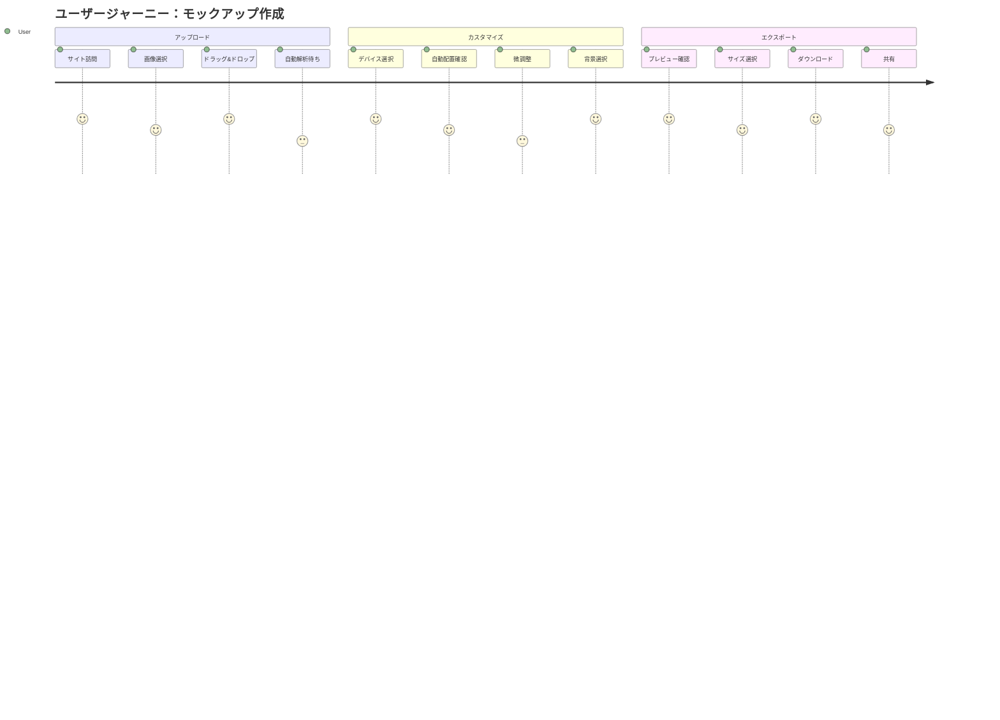
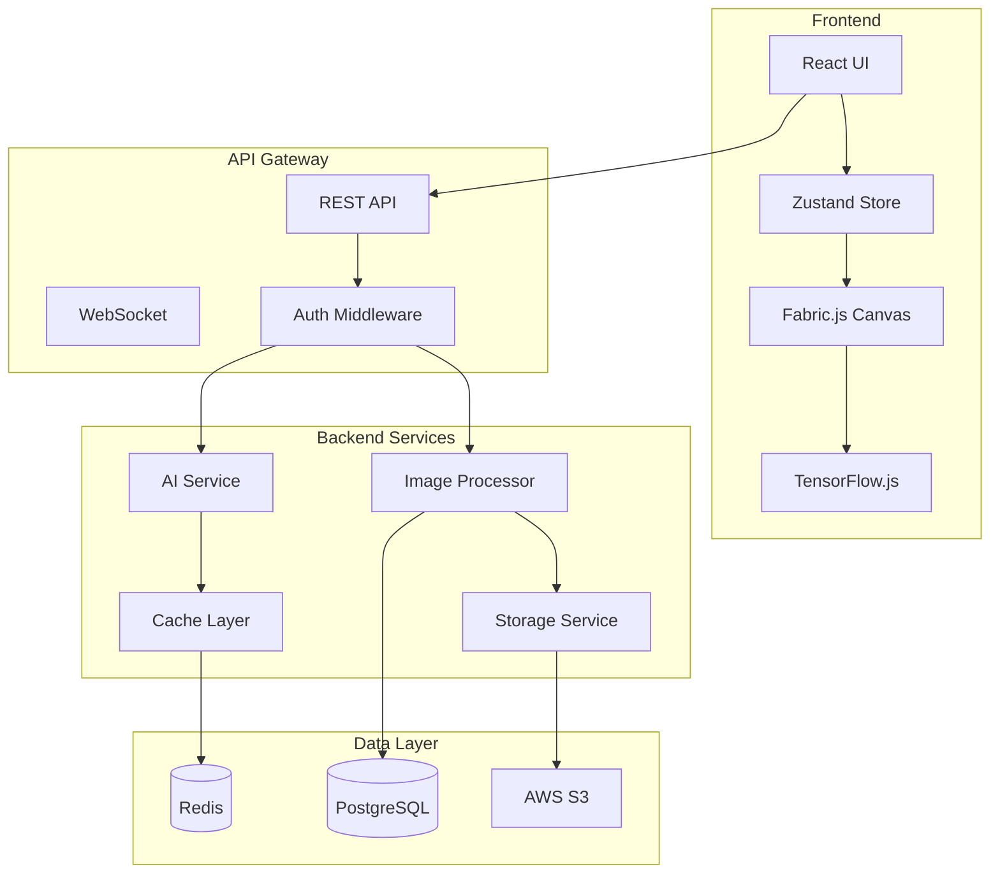

# 📱 モックアップ生成アプリケーション - 完全仕様書

## 目次
1. [プロジェクト概要](#1-プロジェクト概要)
2. [ユーザー体験設計](#2-ユーザー体験設計)
3. [技術仕様](#3-技術仕様)
4. [ディレクトリ構造](#4-ディレクトリ構造)
5. [ステップバイステップ構築ガイド](#5-ステップバイステップ構築ガイド)
6. [詳細実装仕様](#6-詳細実装仕様)
7. [データベース設計](#7-データベース設計)
8. [API仕様](#8-api仕様)
9. [セキュリティ要件](#9-セキュリティ要件)
10. [テスト戦略](#10-テスト戦略)

---

## 1. プロジェクト概要

### 1.1 ビジョン
ユーザーがアップロードしたスクリーンショットを、美しいデバイスモックアップに変換する、AI支援型のWebアプリケーション。

### 1.2 コアバリュー
- **簡単**: 3ステップで完成
- **高速**: AI による自動最適化
- **美しい**: プロフェッショナルな仕上がり
- **柔軟**: 多様なデバイス・レイアウトに対応

### 1.3 技術スタック
```yaml
Frontend:
  - React 18.x
  - TypeScript 5.x
  - Tailwind CSS 3.x
  - Fabric.js 5.x
  - TensorFlow.js 4.x

Backend:
  - Node.js 20.x
  - Express 4.x
  - TypeScript 5.x
  - Sharp 0.32.x
  - Canvas 2.x

Database:
  - PostgreSQL 15.x (本番)
  - SQLite (開発)

Infrastructure:
  - Docker
  - Redis (キャッシュ)
  - S3 (ストレージ)
```

---

## 2. ユーザー体験設計

### 2.1 ユーザーペルソナ

#### Primary User: デザイナー・マーケター
```typescript
interface PrimaryPersona {
  profile: {
    age: "25-40";
    profession: "Designer | Marketer | Product Manager";
    techLevel: "Intermediate";
  };
  needs: [
    "素早くプレゼン資料を作成",
    "SNS用のモックアップ生成",
    "ポートフォリオ用の画像作成"
  ];
  painPoints: [
    "Photoshopは重い・高い",
    "既存ツールは学習曲線が急",
    "複数デバイスの配置が面倒"
  ];
}
```

### 2.2 ユーザージャーニーマップ



### 2.3 画面フロー

```typescript
interface ScreenFlow {
  // ステップ1: アップロード画面
  uploadScreen: {
    components: [
      "DragDropZone",
      "FileInput",
      "RecentUploads",
      "QuickTips"
    ];
    actions: ["upload", "paste", "importFromURL"];
    nextStep: "deviceSelection";
  };
  
  // ステップ2: デバイス選択画面
  deviceSelectionScreen: {
    components: [
      "DeviceGallery",
      "SearchBar",
      "CategoryFilter",
      "PreviewPane"
    ];
    layout: "grid" | "list";
    categories: ["smartphone", "tablet", "laptop", "desktop", "watch"];
    nextStep: "editor";
  };
  
  // ステップ3: 編集画面
  editorScreen: {
    components: [
      "Canvas",
      "Toolbar",
      "LayersPanel",
      "PropertiesPanel",
      "AIAssistant"
    ];
    tools: ["crop", "rotate", "position", "scale"];
    aiFeatures: ["autoFit", "smartCrop", "backgroundGen"];
    nextStep: "export";
  };
  
  // ステップ4: エクスポート画面
  exportScreen: {
    components: [
      "PreviewArea",
      "FormatSelector",
      "QualitySlider",
      "SizePresets"
    ];
    formats: ["PNG", "JPEG", "WebP"];
    presets: ["Instagram", "Twitter", "Facebook", "Custom"];
    actions: ["download", "share", "saveProject"];
  };
}
```

### 2.4 UIコンポーネント仕様

```typescript
// デザインシステム
interface DesignSystem {
  colors: {
    primary: "#6366F1";     // Indigo-500
    secondary: "#8B5CF6";   // Purple-500
    accent: "#EC4899";      // Pink-500
    neutral: {
      50: "#FAFAFA";
      100: "#F4F4F5";
      200: "#E4E4E7";
      300: "#D4D4D8";
      400: "#A1A1AA";
      500: "#71717A";
      600: "#52525B";
      700: "#3F3F46";
      800: "#27272A";
      900: "#18181B";
    };
  };
  
  typography: {
    fontFamily: {
      sans: ["Inter", "system-ui", "sans-serif"];
      mono: ["JetBrains Mono", "monospace"];
    };
    fontSize: {
      xs: "0.75rem";
      sm: "0.875rem";
      base: "1rem";
      lg: "1.125rem";
      xl: "1.25rem";
      "2xl": "1.5rem";
      "3xl": "1.875rem";
      "4xl": "2.25rem";
    };
  };
  
  spacing: {
    unit: 4; // 4px base
    scale: [0, 1, 2, 3, 4, 5, 6, 8, 10, 12, 16, 20, 24, 32, 40, 48, 56, 64];
  };
  
  borderRadius: {
    none: "0";
    sm: "0.125rem";
    base: "0.25rem";
    md: "0.375rem";
    lg: "0.5rem";
    xl: "0.75rem";
    "2xl": "1rem";
    full: "9999px";
  };
  
  shadows: {
    sm: "0 1px 2px 0 rgb(0 0 0 / 0.05)";
    base: "0 1px 3px 0 rgb(0 0 0 / 0.1)";
    md: "0 4px 6px -1px rgb(0 0 0 / 0.1)";
    lg: "0 10px 15px -3px rgb(0 0 0 / 0.1)";
    xl: "0 20px 25px -5px rgb(0 0 0 / 0.1)";
  };
  
  animations: {
    duration: {
      fast: "150ms";
      normal: "300ms";
      slow: "500ms";
    };
    easing: {
      ease: "cubic-bezier(0.4, 0, 0.2, 1)";
      easeIn: "cubic-bezier(0.4, 0, 1, 1)";
      easeOut: "cubic-bezier(0, 0, 0.2, 1)";
      easeInOut: "cubic-bezier(0.4, 0, 0.2, 1)";
    };
  };
}
```

---

## 3. 技術仕様

### 3.1 システムアーキテクチャ

```typescript
interface SystemArchitecture {
  frontend: {
    framework: "React";
    stateManagement: "Zustand";
    styling: "Tailwind CSS + CSS Modules";
    bundler: "Vite";
    testing: "Vitest + React Testing Library";
  };
  
  backend: {
    runtime: "Node.js";
    framework: "Express";
    orm: "Prisma";
    validation: "Zod";
    testing: "Jest";
  };
  
  infrastructure: {
    containerization: "Docker";
    orchestration: "Docker Compose";
    ci_cd: "GitHub Actions";
    monitoring: "Prometheus + Grafana";
    logging: "Winston + ELK Stack";
  };
  
  services: {
    imageProcessing: "Sharp + Canvas";
    aiProcessing: "TensorFlow.js";
    caching: "Redis";
    storage: "AWS S3 | Local FS";
    queue: "Bull";
  };
}
```

### 3.2 データフロー



---

## 4. ディレクトリ構造

### 4.1 モノレポ構造

```bash
mockup-app/
├── .github/
│   ├── workflows/
│   │   ├── ci.yml
│   │   ├── deploy.yml
│   │   └── test.yml
│   └── ISSUE_TEMPLATE/
│
├── packages/
│   ├── client/                    # React フロントエンド
│   │   ├── public/
│   │   │   ├── index.html
│   │   │   ├── manifest.json
│   │   │   └── assets/
│   │   │       ├── frames/       # デバイスフレーム画像
│   │   │       └── templates/    # テンプレート
│   │   │
│   │   ├── src/
│   │   │   ├── app/
│   │   │   │   ├── App.tsx
│   │   │   │   ├── App.css
│   │   │   │   └── App.test.tsx
│   │   │   │
│   │   │   ├── components/       # UIコンポーネント
│   │   │   │   ├── common/
│   │   │   │   │   ├── Button/
│   │   │   │   │   │   ├── Button.tsx
│   │   │   │   │   │   ├── Button.module.css
│   │   │   │   │   │   ├── Button.test.tsx
│   │   │   │   │   │   └── index.ts
│   │   │   │   │   ├── Modal/
│   │   │   │   │   ├── Loader/
│   │   │   │   │   └── Toast/
│   │   │   │   │
│   │   │   │   ├── upload/
│   │   │   │   │   ├── DragDropZone/
│   │   │   │   │   ├── FileInput/
│   │   │   │   │   └── ImagePreview/
│   │   │   │   │
│   │   │   │   ├── device/
│   │   │   │   │   ├── DeviceGallery/
│   │   │   │   │   ├── DeviceCard/
│   │   │   │   │   ├── DeviceFilter/
│   │   │   │   │   └── DeviceSearch/
│   │   │   │   │
│   │   │   │   ├── editor/
│   │   │   │   │   ├── Canvas/
│   │   │   │   │   │   ├── Canvas.tsx
│   │   │   │   │   │   ├── CanvasControls.tsx
│   │   │   │   │   │   ├── CanvasLayers.tsx
│   │   │   │   │   │   └── CanvasUtils.ts
│   │   │   │   │   ├── Toolbar/
│   │   │   │   │   ├── PropertiesPanel/
│   │   │   │   │   └── LayersPanel/
│   │   │   │   │
│   │   │   │   ├── ai/
│   │   │   │   │   ├── SmartCrop/
│   │   │   │   │   ├── BackgroundGen/
│   │   │   │   │   └── LayoutOptimizer/
│   │   │   │   │
│   │   │   │   └── export/
│   │   │   │       ├── ExportPanel/
│   │   │   │       ├── FormatSelector/
│   │   │   │       └── PresetSelector/
│   │   │   │
│   │   │   ├── hooks/            # カスタムフック
│   │   │   │   ├── useCanvas.ts
│   │   │   │   ├── useImageUpload.ts
│   │   │   │   ├── useAI.ts
│   │   │   │   ├── useDevice.ts
│   │   │   │   └── useExport.ts
│   │   │   │
│   │   │   ├── services/         # APIクライアント
│   │   │   │   ├── api/
│   │   │   │   │   ├── client.ts
│   │   │   │   │   ├── upload.service.ts
│   │   │   │   │   ├── device.service.ts
│   │   │   │   │   ├── mockup.service.ts
│   │   │   │   │   └── ai.service.ts
│   │   │   │   └── websocket/
│   │   │   │       └── ws.client.ts
│   │   │   │
│   │   │   ├── store/            # 状態管理
│   │   │   │   ├── index.ts
│   │   │   │   ├── slices/
│   │   │   │   │   ├── app.slice.ts
│   │   │   │   │   ├── canvas.slice.ts
│   │   │   │   │   ├── device.slice.ts
│   │   │   │   │   └── export.slice.ts
│   │   │   │   └── middleware/
│   │   │   │       └── logger.ts
│   │   │   │
│   │   │   ├── utils/            # ユーティリティ
│   │   │   │   ├── canvas/
│   │   │   │   │   ├── transform.ts
│   │   │   │   │   ├── perspective.ts
│   │   │   │   │   └── composite.ts
│   │   │   │   ├── image/
│   │   │   │   │   ├── resize.ts
│   │   │   │   │   ├── crop.ts
│   │   │   │   │   └── filter.ts
│   │   │   │   └── helpers/
│   │   │   │       ├── format.ts
│   │   │   │       ├── validation.ts
│   │   │   │       └── constants.ts
│   │   │   │
│   │   │   ├── types/            # TypeScript型定義
│   │   │   │   ├── index.ts
│   │   │   │   ├── api.types.ts
│   │   │   │   ├── canvas.types.ts
│   │   │   │   ├── device.types.ts
│   │   │   │   └── ai.types.ts
│   │   │   │
│   │   │   └── workers/          # Web Workers
│   │   │       ├── image.worker.ts
│   │   │       └── ai.worker.ts
│   │   │
│   │   ├── package.json
│   │   ├── tsconfig.json
│   │   ├── vite.config.ts
│   │   ├── tailwind.config.js
│   │   └── .env.example
│   │
│   ├── server/                    # Node.js バックエンド
│   │   ├── src/
│   │   │   ├── app.ts
│   │   │   ├── server.ts
│   │   │   │
│   │   │   ├── config/
│   │   │   │   ├── database.ts
│   │   │   │   ├── redis.ts
│   │   │   │   ├── storage.ts
│   │   │   │   └── environment.ts
│   │   │   │
│   │   │   ├── controllers/
│   │   │   │   ├── upload.controller.ts
│   │   │   │   ├── device.controller.ts
│   │   │   │   ├── mockup.controller.ts
│   │   │   │   ├── ai.controller.ts
│   │   │   │   └── export.controller.ts
│   │   │   │
│   │   │   ├── services/
│   │   │   │   ├── image/
│   │   │   │   │   ├── processor.service.ts
│   │   │   │   │   ├── transformer.service.ts
│   │   │   │   │   └── optimizer.service.ts
│   │   │   │   ├── ai/
│   │   │   │   │   ├── smartcrop.service.ts
│   │   │   │   │   ├── background.service.ts
│   │   │   │   │   └── layout.service.ts
│   │   │   │   ├── storage/
│   │   │   │   │   ├── s3.service.ts
│   │   │   │   │   └── local.service.ts
│   │   │   │   └── cache/
│   │   │   │       └── redis.service.ts
│   │   │   │
│   │   │   ├── models/
│   │   │   │   ├── index.ts
│   │   │   │   ├── user.model.ts
│   │   │   │   ├── project.model.ts
│   │   │   │   ├── device.model.ts
│   │   │   │   └── template.model.ts
│   │   │   │
│   │   │   ├── middlewares/
│   │   │   │   ├── auth.middleware.ts
│   │   │   │   ├── error.middleware.ts
│   │   │   │   ├── validation.middleware.ts
│   │   │   │   └── rateLimit.middleware.ts
│   │   │   │
│   │   │   ├── routes/
│   │   │   │   ├── index.ts
│   │   │   │   ├── upload.routes.ts
│   │   │   │   ├── device.routes.ts
│   │   │   │   ├── mockup.routes.ts
│   │   │   │   └── ai.routes.ts
│   │   │   │
│   │   │   ├── utils/
│   │   │   │   ├── logger.ts
│   │   │   │   ├── validator.ts
│   │   │   │   └── helpers.ts
│   │   │   │
│   │   │   ├── workers/
│   │   │   │   ├── image.worker.ts
│   │   │   │   └── ai.worker.ts
│   │   │   │
│   │   │   └── types/
│   │   │       └── index.ts
│   │   │
│   │   ├── prisma/
│   │   │   ├── schema.prisma
│   │   │   ├── migrations/
│   │   │   └── seed.ts
│   │   │
│   │   ├── tests/
│   │   │   ├── unit/
│   │   │   ├── integration/
│   │   │   └── e2e/
│   │   │
│   │   ├── package.json
│   │   ├── tsconfig.json
│   │   └── .env.example
│   │
│   └── shared/                    # 共有パッケージ
│       ├── src/
│       │   ├── types/
│       │   ├── constants/
│       │   └── utils/
│       ├── package.json
│       └── tsconfig.json
│
├── docker/
│   ├── Dockerfile.client
│   ├── Dockerfile.server
│   └── docker-compose.yml
│
├── scripts/
│   ├── setup.sh
│   ├── dev.sh
│   ├── build.sh
│   └── deploy.sh
│
├── docs/
│   ├── API.md
│   ├── SETUP.md
│   └── CONTRIBUTING.md
│
├── .gitignore
├── .prettierrc
├── .eslintrc.js
├── lerna.json
├── package.json
└── README.md
```

---

## 5. ステップバイステップ構築ガイド

### Phase 1: 基盤構築（Week 1-2）

#### Step 1.1: プロジェクトセットアップ
```bash
# プロジェクト作成
mkdir mockup-app && cd mockup-app
npm init -y
npx lerna init

# 基本パッケージ作成
mkdir -p packages/{client,server,shared}

# Client セットアップ
cd packages/client
npm create vite@latest . -- --template react-ts
npm install

# Server セットアップ
cd ../server
npm init -y
npm install express typescript @types/node @types/express
npm install -D nodemon ts-node

# Shared セットアップ
cd ../shared
npm init -y
npm install typescript
```

#### Step 1.2: 開発環境構築
```typescript
// docker-compose.yml
version: '3.8'
services:
  client:
    build:
      context: .
      dockerfile: docker/Dockerfile.client
    ports:
      - "3000:3000"
    volumes:
      - ./packages/client:/app
    environment:
      - NODE_ENV=development

  server:
    build:
      context: .
      dockerfile: docker/Dockerfile.server
    ports:
      - "5000:5000"
    volumes:
      - ./packages/server:/app
    environment:
      - NODE_ENV=development
      - DATABASE_URL=postgresql://user:pass@db:5432/mockup

  db:
    image: postgres:15
    environment:
      - POSTGRES_USER=user
      - POSTGRES_PASSWORD=pass
      - POSTGRES_DB=mockup
    volumes:
      - postgres_data:/var/lib/postgresql/data

  redis:
    image: redis:7
    ports:
      - "6379:6379"

volumes:
  postgres_data:
```

### Phase 2: コア機能実装（Week 3-4）

#### Step 2.1: ファイルアップロード機能
```typescript
// client/src/components/upload/DragDropZone.tsx
import React, { useCallback, useState } from 'react';
import { useDropzone } from 'react-dropzone';

interface DragDropZoneProps {
  onUpload: (files: File[]) => void;
  maxFiles?: number;
  maxSize?: number;
  accept?: string[];
}

export const DragDropZone: React.FC<DragDropZoneProps> = ({
  onUpload,
  maxFiles = 10,
  maxSize = 10485760, // 10MB
  accept = ['image/jpeg', 'image/png', 'image/webp']
}) => {
  const [isDragging, setIsDragging] = useState(false);
  const [uploadProgress, setUploadProgress] = useState(0);

  const onDrop = useCallback((acceptedFiles: File[]) => {
    setUploadProgress(0);
    onUpload(acceptedFiles);
    
    // Simulate upload progress
    const interval = setInterval(() => {
      setUploadProgress(prev => {
        if (prev >= 100) {
          clearInterval(interval);
          return 100;
        }
        return prev + 10;
      });
    }, 200);
  }, [onUpload]);

  const { getRootProps, getInputProps, isDragActive } = useDropzone({
    onDrop,
    maxFiles,
    maxSize,
    accept: accept.reduce((acc, type) => ({ ...acc, [type]: [] }), {}),
    onDragEnter: () => setIsDragging(true),
    onDragLeave: () => setIsDragging(false)
  });

  return (
    <div
      {...getRootProps()}
      className={`
        relative border-2 border-dashed rounded-xl p-12 transition-all
        ${isDragging ? 'border-primary bg-primary/5 scale-105' : 'border-gray-300'}
        hover:border-primary hover:bg-gray-50 cursor-pointer
      `}
    >
      <input {...getInputProps()} />
      
      {uploadProgress > 0 && uploadProgress < 100 && (
        <div className="absolute inset-0 bg-white/90 flex items-center justify-center rounded-xl">
          <div className="w-64">
            <div className="h-2 bg-gray-200 rounded-full overflow-hidden">
              <div 
                className="h-full bg-primary transition-all duration-300"
                style={{ width: `${uploadProgress}%` }}
              />
            </div>
            <p className="text-center mt-2 text-sm text-gray-600">
              Uploading... {uploadProgress}%
            </p>
          </div>
        </div>
      )}

      {uploadProgress === 0 && (
        <div className="text-center">
          <svg
            className="mx-auto h-12 w-12 text-gray-400"
            stroke="currentColor"
            fill="none"
            viewBox="0 0 48 48"
          >
            <path
              d="M28 8H12a4 4 0 00-4 4v20m32-12v8m0 0v8a4 4 0 01-4 4H12a4 4 0 01-4-4v-4m32-4l-3.172-3.172a4 4 0 00-5.656 0L28 28M8 32l9.172-9.172a4 4 0 015.656 0L28 28m0 0l4 4m4-24h8m-4-4v8m-12 4h.02"
              strokeWidth={2}
              strokeLinecap="round"
              strokeLinejoin="round"
            />
          </svg>
          
          <p className="mt-4 text-lg font-medium">
            {isDragActive ? 'Drop your images here' : 'Drag & drop your screenshots'}
          </p>
          
          <p className="mt-2 text-sm text-gray-600">
            or <span className="text-primary font-medium">browse files</span>
          </p>
          
          <p className="mt-4 text-xs text-gray-500">
            Supports: JPG, PNG, WebP (Max {maxSize / 1048576}MB per file)
          </p>
        </div>
      )}
    </div>
  );
};
```

#### Step 2.2: Canvas編集機能
```typescript
// client/src/components/editor/Canvas.tsx
import React, { useEffect, useRef, useState } from 'react';
import { fabric } from 'fabric';
import { Device, CanvasState } from '@/types';

interface CanvasProps {
  image: string;
  device: Device;
  onUpdate: (state: CanvasState) => void;
}

export const Canvas: React.FC<CanvasProps> = ({ image, device, onUpdate }) => {
  const canvasRef = useRef<HTMLCanvasElement>(null);
  const [fabricCanvas, setFabricCanvas] = useState<fabric.Canvas | null>(null);
  const [zoom, setZoom] = useState(1);

  useEffect(() => {
    if (!canvasRef.current) return;

    const canvas = new fabric.Canvas(canvasRef.current, {
      width: 800,
      height: 600,
      backgroundColor: '#f3f4f6'
    });

    setFabricCanvas(canvas);

    // Cleanup
    return () => {
      canvas.dispose();
    };
  }, []);

  useEffect(() => {
    if (!fabricCanvas || !image || !device) return;

    // Load device frame
    fabric.Image.fromURL(device.frameImage, (frameImg) => {
      frameImg.set({
        left: 0,
        top: 0,
        selectable: false,
        evented: false
      });
      fabricCanvas.add(frameImg);

      // Load and position user image
      fabric.Image.fromURL(image, (userImg) => {
        // Apply perspective transform for screen area
        const screenArea = device.screenArea;
        
        userImg.set({
          left: screenArea.x,
          top: screenArea.y,
          angle: screenArea.rotation || 0,
          scaleX: screenArea.width / userImg.width!,
          scaleY: screenArea.height / userImg.height!
        });

        // Add image behind frame
        fabricCanvas.add(userImg);
        fabricCanvas.sendToBack(userImg);
        frameImg.bringToFront();

        fabricCanvas.renderAll();
        
        // Update state
        onUpdate({
          objects: fabricCanvas.getObjects(),
          zoom,
          dimensions: {
            width: fabricCanvas.width!,
            height: fabricCanvas.height!
          }
        });
      });
    });
  }, [fabricCanvas, image, device]);

  const handleZoom = (delta: number) => {
    if (!fabricCanvas) return;
    
    const newZoom = Math.max(0.1, Math.min(3, zoom + delta));
    fabricCanvas.setZoom(newZoom);
    setZoom(newZoom);
  };

  return (
    <div className="relative bg-gray-100 rounded-lg overflow-hidden">
      {/* Toolbar */}
      <div className="absolute top-4 left-4 z-10 bg-white rounded-lg shadow-lg p-2 flex gap-2">
        <button
          onClick={() => handleZoom(-0.1)}
          className="p-2 hover:bg-gray-100 rounded"
        >
          <svg className="w-5 h-5" fill="none" stroke="currentColor">
            <path strokeLinecap="round" strokeLinejoin="round" strokeWidth={2} d="M21 21l-6-6m2-5a7 7 0 11-14 0 7 7 0 0114 0zM13 10H7" />
          </svg>
        </button>
        <span className="px-3 py-2 text-sm font-medium">
          {Math.round(zoom * 100)}%
        </span>
        <button
          onClick={() => handleZoom(0.1)}
          className="p-2 hover:bg-gray-100 rounded"
        >
          <svg className="w-5 h-5" fill="none" stroke="currentColor">
            <path strokeLinecap="round" strokeLinejoin="round" strokeWidth={2} d="M21 21l-6-6m2-5a7 7 0 11-14 0 7 7 0 0114 0zM10 7v6m3-3H7" />
          </svg>
        </button>
      </div>

      {/* Canvas */}
      <canvas ref={canvasRef} />
    </div>
  );
};
```

### Phase 3: AI機能実装（Week 5-6）

#### Step 3.1: スマートクロップ機能
```typescript
// client/src/services/ai/smartCrop.ts
import * as tf from '@tensorflow/tfjs';

interface CropSuggestion {
  x: number;
  y: number;
  width: number;
  height: number;
  confidence: number;
}

export class SmartCropService {
  private model: tf.LayersModel | null = null;

  async initialize() {
    // Load pre-trained model for object detection
    this.model = await tf.loadLayersModel('/models/smartcrop/model.json');
  }

  async suggestCrop(
    imageData: ImageData,
    targetAspectRatio: number
  ): Promise<CropSuggestion> {
    if (!this.model) {
      throw new Error('Model not initialized');
    }

    // Convert image to tensor
    const imageTensor = tf.browser.fromPixels(imageData);
    const resized = tf.image.resizeBilinear(imageTensor, [224, 224]);
    const normalized = resized.div(255.0);
    const batched = normalized.expandDims(0);

    // Run inference
    const predictions = this.model.predict(batched) as tf.Tensor;
    const boxes = await predictions.array();

    // Process predictions
    const suggestion = this.processPredictions(
      boxes[0],
      imageData.width,
      imageData.height,
      targetAspectRatio
    );

    // Cleanup
    imageTensor.dispose();
    resized.dispose();
    normalized.dispose();
    batched.dispose();
    predictions.dispose();

    return suggestion;
  }

  private processPredictions(
    boxes: number[][],
    imageWidth: number,
    imageHeight: number,
    targetAspectRatio: number
  ): CropSuggestion {
    // Find the main subject area
    const mainSubject = this.findMainSubject(boxes);
    
    // Calculate optimal crop maintaining aspect ratio
    const crop = this.calculateOptimalCrop(
      mainSubject,
      imageWidth,
      imageHeight,
      targetAspectRatio
    );

    return crop;
  }

  private findMainSubject(boxes: number[][]): { x: number; y: number; width: number; height: number } {
    // Algorithm to find the most important area
    // This is simplified - real implementation would use more sophisticated logic
    if (boxes.length === 0) {
      return { x: 0.25, y: 0.25, width: 0.5, height: 0.5 };
    }

    // Use the largest detected box as main subject
    let maxArea = 0;
    let mainBox = boxes[0];
    
    for (const box of boxes) {
      const area = box[2] * box[3]; // width * height
      if (area > maxArea) {
        maxArea = area;
        mainBox = box;
      }
    }

    return {
      x: mainBox[0],
      y: mainBox[1],
      width: mainBox[2],
      height: mainBox[3]
    };
  }

  private calculateOptimalCrop(
    subject: { x: number; y: number; width: number; height: number },
    imageWidth: number,
    imageHeight: number,
    targetAspectRatio: number
  ): CropSuggestion {
    // Center the crop around the subject
    const centerX = subject.x + subject.width / 2;
    const centerY = subject.y + subject.height / 2;

    // Calculate crop dimensions based on aspect ratio
    let cropWidth, cropHeight;
    
    if (targetAspectRatio > 1) {
      // Landscape
      cropHeight = Math.min(imageHeight, subject.height * 1.5);
      cropWidth = cropHeight * targetAspectRatio;
    } else {
      // Portrait
      cropWidth = Math.min(imageWidth, subject.width * 1.5);
      cropHeight = cropWidth / targetAspectRatio;
    }

    // Ensure crop doesn't exceed image bounds
    const x = Math.max(0, Math.min(centerX - cropWidth / 2, imageWidth - cropWidth));
    const y = Math.max(0, Math.min(centerY - cropHeight / 2, imageHeight - cropHeight));

    return {
      x: Math.round(x),
      y: Math.round(y),
      width: Math.round(cropWidth),
      height: Math.round(cropHeight),
      confidence: 0.85
    };
  }
}
```

### Phase 4: バックエンドAPI実装（Week 7-8）

#### Step 4.1: 画像処理API
```typescript
// server/src/services/image/processor.service.ts
import sharp from 'sharp';
import { Canvas, Image } from 'canvas';

export interface ProcessOptions {
  resize?: { width: number; height: number };
  crop?: { x: number; y: number; width: number; height: number };
  rotate?: number;
  format?: 'jpeg' | 'png' | 'webp';
  quality?: number;
}

export class ImageProcessorService {
  async processImage(
    inputBuffer: Buffer,
    options: ProcessOptions
  ): Promise<Buffer> {
    let pipeline = sharp(inputBuffer);

    // Apply transformations
    if (options.crop) {
      pipeline = pipeline.extract(options.crop);
    }

    if (options.resize) {
      pipeline = pipeline.resize(options.resize.width, options.resize.height);
    }

    if (options.rotate) {
      pipeline = pipeline.rotate(options.rotate);
    }

    // Format conversion
    if (options.format) {
      pipeline = pipeline.toFormat(options.format, {
        quality: options.quality || 85
      });
    }

    return await pipeline.toBuffer();
  }

  async compositeImages(
    background: Buffer,
    overlay: Buffer,
    position: { x: number; y: number }
  ): Promise<Buffer> {
    const composite = await sharp(background)
      .composite([
        {
          input: overlay,
          left: position.x,
          top: position.y
        }
      ])
      .toBuffer();

    return composite;
  }

  async applyPerspectiveTransform(
    imageBuffer: Buffer,
    corners: { tl: Point; tr: Point; bl: Point; br: Point },
    outputSize: { width: number; height: number }
  ): Promise<Buffer> {
    // Use canvas for perspective transform
    const canvas = new Canvas(outputSize.width, outputSize.height);
    const ctx = canvas.getContext('2d');
    
    const img = new Image();
    img.src = imageBuffer;

    // Apply perspective transformation matrix
    const matrix = this.calculatePerspectiveMatrix(
      corners,
      outputSize
    );

    ctx.setTransform(
      matrix.a, matrix.b, matrix.c,
      matrix.d, matrix.e, matrix.f
    );

    ctx.drawImage(img, 0, 0);
    
    return canvas.toBuffer('image/png');
  }

  private calculatePerspectiveMatrix(
    corners: { tl: Point; tr: Point; bl: Point; br: Point },
    size: { width: number; height: number }
  ): DOMMatrix2DInit {
    // Perspective transformation calculation
    // This is a simplified version - real implementation would use
    // proper homography matrix calculations
    return {
      a: 1, b: 0, c: 0,
      d: 1, e: 0, f: 0
    };
  }
}

interface Point {
  x: number;
  y: number;
}
```

---

## 6. 詳細実装仕様

### 6.1 状態管理仕様

```typescript
// client/src/store/index.ts
import { create } from 'zustand';
import { devtools, persist } from 'zustand/middleware';

interface AppState {
  // Upload State
  uploadedImages: UploadedImage[];
  currentImageId: string | null;
  uploadProgress: number;
  
  // Device State
  selectedDevices: Device[];
  deviceLibrary: Device[];
  customFrames: CustomFrame[];
  
  // Canvas State
  canvasObjects: fabric.Object[];
  canvasHistory: CanvasSnapshot[];
  historyIndex: number;
  
  // AI State
  aiProcessing: boolean;
  aiSuggestions: AISuggestion[];
  
  // Export State
  exportSettings: ExportSettings;
  exportProgress: number;
  
  // Actions
  uploadImage: (file: File) => Promise<void>;
  selectDevice: (deviceId: string) => void;
  updateCanvas: (objects: fabric.Object[]) => void;
  undo: () => void;
  redo: () => void;
  processWithAI: (type: AIProcessType) => Promise<void>;
  exportMockup: (settings: ExportSettings) => Promise<Blob>;
}

export const useAppStore = create<AppState>()(
  devtools(
    persist(
      (set, get) => ({
        // Initial state
        uploadedImages: [],
        currentImageId: null,
        uploadProgress: 0,
        selectedDevices: [],
        deviceLibrary: [],
        customFrames: [],
        canvasObjects: [],
        canvasHistory: [],
        historyIndex: -1,
        aiProcessing: false,
        aiSuggestions: [],
        exportSettings: {
          format: 'png',
          quality: 95,
          resolution: { width: 1920, height: 1080 }
        },
        exportProgress: 0,

        // Actions implementation
        uploadImage: async (file: File) => {
          set({ uploadProgress: 0 });
          
          const formData = new FormData();
          formData.append('image', file);
          
          const response = await fetch('/api/upload', {
            method: 'POST',
            body: formData,
            onUploadProgress: (progress) => {
              set({ uploadProgress: progress.loaded / progress.total * 100 });
            }
          });
          
          const uploadedImage = await response.json();
          
          set((state) => ({
            uploadedImages: [...state.uploadedImages, uploadedImage],
            currentImageId: uploadedImage.id,
            uploadProgress: 100
          }));
        },

        selectDevice: (deviceId: string) => {
          const device = get().deviceLibrary.find(d => d.id === deviceId);
          if (device) {
            set((state) => ({
              selectedDevices: [...state.selectedDevices, device]
            }));
          }
        },

        updateCanvas: (objects: fabric.Object[]) => {
          const snapshot = {
            objects: objects.map(obj => obj.toObject()),
            timestamp: Date.now()
          };
          
          set((state) => {
            const newHistory = state.canvasHistory.slice(0, state.historyIndex + 1);
            newHistory.push(snapshot);
            
            return {
              canvasObjects: objects,
              canvasHistory: newHistory,
              historyIndex: newHistory.length - 1
            };
          });
        },

        undo: () => {
          const { historyIndex, canvasHistory } = get();
          if (historyIndex > 0) {
            set({ historyIndex: historyIndex - 1 });
            // Restore canvas state from history
          }
        },

        redo: () => {
          const { historyIndex, canvasHistory } = get();
          if (historyIndex < canvasHistory.length - 1) {
            set({ historyIndex: historyIndex + 1 });
            // Restore canvas state from history
          }
        },

        processWithAI: async (type: AIProcessType) => {
          set({ aiProcessing: true });
          
          try {
            const response = await fetch(`/api/ai/${type}`, {
              method: 'POST',
              headers: { 'Content-Type': 'application/json' },
              body: JSON.stringify({
                imageId: get().currentImageId,
                devices: get().selectedDevices
              })
            });
            
            const suggestions = await response.json();
            set({ aiSuggestions: suggestions });
          } finally {
            set({ aiProcessing: false });
          }
        },

        exportMockup: async (settings: ExportSettings) => {
          set({ exportProgress: 0 });
          
          const response = await fetch('/api/export', {
            method: 'POST',
            headers: { 'Content-Type': 'application/json' },
            body: JSON.stringify({
              canvas: get().canvasObjects,
              settings
            }),
            onDownloadProgress: (progress) => {
              set({ exportProgress: progress.loaded / progress.total * 100 });
            }
          });
          
          const blob = await response.blob();
          set({ exportProgress: 100 });
          
          return blob;
        }
      }),
      {
        name: 'mockup-app-storage',
        partialize: (state) => ({
          deviceLibrary: state.deviceLibrary,
          customFrames: state.customFrames,
          exportSettings: state.exportSettings
        })
      }
    )
  )
);
```

---

## 7. データベース設計

### 7.1 Prisma Schema

```prisma
// server/prisma/schema.prisma
generator client {
  provider = "prisma-client-js"
}

datasource db {
  provider = "postgresql"
  url      = env("DATABASE_URL")
}

model User {
  id              String    @id @default(cuid())
  email           String    @unique
  name            String?
  avatarUrl       String?
  createdAt       DateTime  @default(now())
  updatedAt       DateTime  @updatedAt
  
  projects        Project[]
  customFrames    CustomFrame[]
  savedTemplates  Template[]
}

model Project {
  id              String    @id @default(cuid())
  name            String
  description     String?
  thumbnail       String?
  isPublic        Boolean   @default(false)
  createdAt       DateTime  @default(now())
  updatedAt       DateTime  @updatedAt
  
  userId          String
  user            User      @relation(fields: [userId], references: [id])
  
  images          ProjectImage[]
  mockups         Mockup[]
}

model ProjectImage {
  id              String    @id @default(cuid())
  url             String
  originalName    String
  mimeType        String
  size            Int
  width           Int
  height          Int
  metadata        Json?
  createdAt       DateTime  @default(now())
  
  projectId       String
  project         Project   @relation(fields: [projectId], references: [id])
  
  mockups         Mockup[]
}

model Device {
  id              String    @id @default(cuid())
  name            String
  category        DeviceCategory
  brand           String?
  model           String?
  frameUrl        String
  maskUrl         String?
  screenArea      Json      // { x, y, width, height, rotation }
  thumbnail       String
  isPremium       Boolean   @default(false)
  createdAt       DateTime  @default(now())
  
  mockups         Mockup[]
  templates       Template[]
}

model CustomFrame {
  id              String    @id @default(cuid())
  name            String
  frameUrl        String
  maskUrl         String?
  screenArea      Json
  thumbnail       String
  isPublic        Boolean   @default(false)
  createdAt       DateTime  @default(now())
  
  userId          String
  user            User      @relation(fields: [userId], references: [id])
}

model Mockup {
  id              String    @id @default(cuid())
  name            String?
  canvasData      Json      // Fabric.js canvas JSON
  exportUrl       String?
  settings        Json      // Export settings
  createdAt       DateTime  @default(now())
  updatedAt       DateTime  @updatedAt
  
  projectId       String
  project         Project   @relation(fields: [projectId], references: [id])
  
  imageId         String
  image           ProjectImage @relation(fields: [imageId], references: [id])
  
  deviceId        String
  device          Device    @relation(fields: [deviceId], references: [id])
}

model Template {
  id              String    @id @default(cuid())
  name            String
  description     String?
  thumbnail       String
  category        TemplateCategory
  layout          Json      // Layout configuration
  isPublic        Boolean   @default(false)
  usageCount      Int       @default(0)
  createdAt       DateTime  @default(now())
  updatedAt       DateTime  @updatedAt
  
  userId          String
  user            User      @relation(fields: [userId], references: [id])
  
  devices         Device[]
}

enum DeviceCategory {
  SMARTPHONE
  TABLET
  LAPTOP
  DESKTOP
  WATCH
  TV
}

enum TemplateCategory {
  SOCIAL_MEDIA
  PRESENTATION
  PORTFOLIO
  MARKETING
  CUSTOM
}
```

---

## 8. API仕様

### 8.1 RESTful API エンドポイント

```typescript
// API Routes Definition
interface APIRoutes {
  // Upload Routes
  'POST /api/upload': {
    body: FormData; // image file
    response: UploadedImage;
  };
  
  'POST /api/upload/batch': {
    body: FormData; // multiple image files
    response: UploadedImage[];
  };
  
  'DELETE /api/upload/:id': {
    params: { id: string };
    response: { success: boolean };
  };

  // Device Routes
  'GET /api/devices': {
    query?: {
      category?: DeviceCategory;
      search?: string;
      limit?: number;
      offset?: number;
    };
    response: {
      devices: Device[];
      total: number;
    };
  };
  
  'GET /api/devices/:id': {
    params: { id: string };
    response: Device;
  };
  
  'POST /api/devices/custom': {
    body: {
      name: string;
      frameImage: string; // base64
      screenArea: ScreenArea;
    };
    response: CustomFrame;
  };

  // Mockup Routes
  'POST /api/mockups/generate': {
    body: {
      imageId: string;
      deviceId: string;
      adjustments?: ImageAdjustments;
    };
    response: {
      mockupId: string;
      previewUrl: string;
    };
  };
  
  'POST /api/mockups/composite': {
    body: {
      mockups: Array<{
        imageId: string;
        deviceId: string;
        position: { x: number; y: number };
      }>;
      layout: LayoutConfig;
      background: BackgroundConfig;
    };
    response: {
      compositeId: string;
      previewUrl: string;
    };
  };
  
  'POST /api/mockups/:id/export': {
    params: { id: string };
    body: ExportSettings;
    response: {
      downloadUrl: string;
      expiresAt: string;
    };
  };

  // AI Routes
  'POST /api/ai/smart-crop': {
    body: {
      imageId: string;
      targetAspectRatio: number;
    };
    response: {
      suggestions: CropSuggestion[];
    };
  };
  
  'POST /api/ai/remove-background': {
    body: {
      imageId: string;
    };
    response: {
      processedImageUrl: string;
      maskUrl: string;
    };
  };
  
  'POST /api/ai/generate-background': {
    body: {
      style: 'blur' | 'gradient' | 'pattern';
      colors?: string[];
      intensity?: number;
    };
    response: {
      backgroundUrl: string;
    };
  };
  
  'POST /api/ai/optimize-layout': {
    body: {
      devices: string[];
      canvasSize: { width: number; height: number };
      preferences?: LayoutPreferences;
    };
    response: {
      layouts: LayoutSuggestion[];
    };
  };

  // Template Routes
  'GET /api/templates': {
    query?: {
      category?: TemplateCategory;
      isPublic?: boolean;
    };
    response: Template[];
  };
  
  'POST /api/templates': {
    body: {
      name: string;
      layout: LayoutConfig;
      devices: string[];
    };
    response: Template;
  };
  
  'POST /api/templates/:id/apply': {
    params: { id: string };
    body: {
      images: string[];
    };
    response: {
      mockupId: string;
      previewUrl: string;
    };
  };
}
```

### 8.2 WebSocket Events

```typescript
// WebSocket Event Definitions
interface WebSocketEvents {
  // Client -> Server
  'process:start': {
    taskId: string;
    type: 'upload' | 'ai' | 'export';
    data: any;
  };
  
  'process:cancel': {
    taskId: string;
  };
  
  'canvas:update': {
    projectId: string;
    changes: CanvasChange[];
  };

  // Server -> Client
  'process:progress': {
    taskId: string;
    progress: number;
    status: string;
  };
  
  'process:complete': {
    taskId: string;
    result: any;
  };
  
  'process:error': {
    taskId: string;
    error: string;
  };
  
  'canvas:sync': {
    projectId: string;
    changes: CanvasChange[];
    userId: string;
  };
}
```

---

## 9. セキュリティ要件

### 9.1 セキュリティ対策

```typescript
// Security Configuration
interface SecurityConfig {
  // Rate Limiting
  rateLimiting: {
    upload: {
      windowMs: 15 * 60 * 1000, // 15 minutes
      max: 10, // limit each IP to 10 requests per windowMs
    };
    api: {
      windowMs: 15 * 60 * 1000,
      max: 100,
    };
  };

  // File Validation
  fileValidation: {
    maxSize: 10 * 1024 * 1024, // 10MB
    allowedMimeTypes: [
      'image/jpeg',
      'image/png',
      'image/webp',
      'image/gif'
    ];
    virusScan: boolean;
  };

  // CORS Configuration
  cors: {
    origin: process.env.CLIENT_URL || 'http://localhost:3000',
    credentials: true,
    methods: ['GET', 'POST', 'PUT', 'DELETE'],
    allowedHeaders: ['Content-Type', 'Authorization'],
  };

  // Authentication
  auth: {
    jwtSecret: process.env.JWT_SECRET,
    jwtExpiry: '7d',
    refreshTokenExpiry: '30d',
  };

  // Content Security Policy
  csp: {
    directives: {
      defaultSrc: ["'self'"],
      scriptSrc: ["'self'", "'unsafe-inline'"],
      styleSrc: ["'self'", "'unsafe-inline'"],
      imgSrc: ["'self'", 'data:', 'blob:'],
      connectSrc: ["'self'", 'ws:', 'wss:'],
    };
  };
}
```

### 9.2 入力検証

```typescript
// Validation Schemas using Zod
import { z } from 'zod';

const uploadSchema = z.object({
  file: z.custom<File>((file) => {
    if (!(file instanceof File)) return false;
    if (file.size > 10 * 1024 * 1024) return false;
    const allowedTypes = ['image/jpeg', 'image/png', 'image/webp'];
    return allowedTypes.includes(file.type);
  }),
});

const mockupGenerateSchema = z.object({
  imageId: z.string().cuid(),
  deviceId: z.string().cuid(),
  adjustments: z.object({
    x: z.number().min(0),
    y: z.number().min(0),
    scale: z.number().min(0.1).max(5),
    rotation: z.number().min(-360).max(360),
  }).optional(),
});

const exportSchema = z.object({
  format: z.enum(['png', 'jpeg', 'webp']),
  quality: z.number().min(1).max(100),
  resolution: z.object({
    width: z.number().min(100).max(8192),
    height: z.number().min(100).max(8192),
  }),
});
```

---

## 10. テスト戦略

### 10.1 単体テスト

```typescript
// Example Unit Test
import { describe, it, expect, vi } from 'vitest';
import { ImageProcessorService } from '@/services/image/processor.service';

describe('ImageProcessorService', () => {
  let service: ImageProcessorService;

  beforeEach(() => {
    service = new ImageProcessorService();
  });

  describe('processImage', () => {
    it('should resize image correctly', async () => {
      const inputBuffer = Buffer.from('mock-image-data');
      const options = {
        resize: { width: 800, height: 600 }
      };

      const result = await service.processImage(inputBuffer, options);
      
      expect(result).toBeInstanceOf(Buffer);
      // Add more specific assertions
    });

    it('should handle crop operations', async () => {
      const inputBuffer = Buffer.from('mock-image-data');
      const options = {
        crop: { x: 100, y: 100, width: 400, height: 300 }
      };

      const result = await service.processImage(inputBuffer, options);
      
      expect(result).toBeInstanceOf(Buffer);
    });
  });
});
```

### 10.2 統合テスト

```typescript
// Integration Test Example
import request from 'supertest';
import { app } from '@/app';

describe('Mockup API Integration', () => {
  describe('POST /api/mockups/generate', () => {
    it('should generate mockup successfully', async () => {
      // Upload image first
      const uploadRes = await request(app)
        .post('/api/upload')
        .attach('image', 'test/fixtures/sample.jpg');
      
      const imageId = uploadRes.body.id;

      // Generate mockup
      const mockupRes = await request(app)
        .post('/api/mockups/generate')
        .send({
          imageId,
          deviceId: 'iphone-15-pro',
          adjustments: {
            x: 0,
            y: 0,
            scale: 1,
            rotation: 0
          }
        });

      expect(mockupRes.status).toBe(200);
      expect(mockupRes.body).toHaveProperty('mockupId');
      expect(mockupRes.body).toHaveProperty('previewUrl');
    });
  });
});
```

### 10.3 E2Eテスト

```typescript
// E2E Test with Playwright
import { test, expect } from '@playwright/test';

test.describe('Mockup Creation Flow', () => {
  test('should complete full mockup creation', async ({ page }) => {
    // Navigate to app
    await page.goto('http://localhost:3000');

    // Upload image
    const fileInput = page.locator('input[type="file"]');
    await fileInput.setInputFiles('test/fixtures/screenshot.png');

    // Wait for upload
    await page.waitForSelector('[data-testid="upload-success"]');

    // Select device
    await page.click('[data-testid="device-iphone-15"]');

    // Adjust position
    const canvas = page.locator('canvas');
    await canvas.dragTo(canvas, {
      sourcePosition: { x: 100, y: 100 },
      targetPosition: { x: 200, y: 200 }
    });

    // Export mockup
    await page.click('[data-testid="export-button"]');
    await page.selectOption('[data-testid="format-select"]', 'png');
    await page.click('[data-testid="download-button"]');

    // Verify download
    const download = await page.waitForEvent('download');
    expect(download.suggestedFilename()).toContain('mockup');
  });
});
```

---

## 実装優先順位とマイルストーン

### Phase 1 (MVP - 2週間)
1. ✅ 基本的なファイルアップロード
2. ✅ シンプルなデバイス選択（5-10種類）
3. ✅ 基本的な画像配置
4. ✅ PNG/JPEG エクスポート

### Phase 2 (Core Features - 2週間)
1. ⬜ 複数デバイス対応
2. ⬜ カスタムフレームアップロード
3. ⬜ 背景カスタマイズ
4. ⬜ プリセットテンプレート

### Phase 3 (AI Integration - 2週間)
1. ⬜ スマートクロップ
2. ⬜ 背景自動生成
3. ⬜ レイアウト最適化
4. ⬜ 画像補正

### Phase 4 (Polish & Scale - 2週間)
1. ⬜ パフォーマンス最適化
2. ⬜ モバイル対応
3. ⬜ ユーザーアカウント
4. ⬜ 共有機能

---

## まとめ

この仕様書は、モックアップ生成アプリケーションの完全な技術仕様と実装ガイドです。段階的な実装により、MVPから高度なAI機能まで、着実に機能を追加していくことができます。

重要なポイント：
- **ユーザー体験を最優先**: 3ステップで完成する簡単な操作性
- **AI活用**: 自動化により作業効率を大幅に向上
- **スケーラブルな設計**: 将来の機能拡張を考慮したアーキテクチャ
- **パフォーマンス**: Web Workerやキャッシュを活用した高速処理

この仕様書を基に開発を進めることで、プロフェッショナルなモックアップアプリケーションを構築できます。
